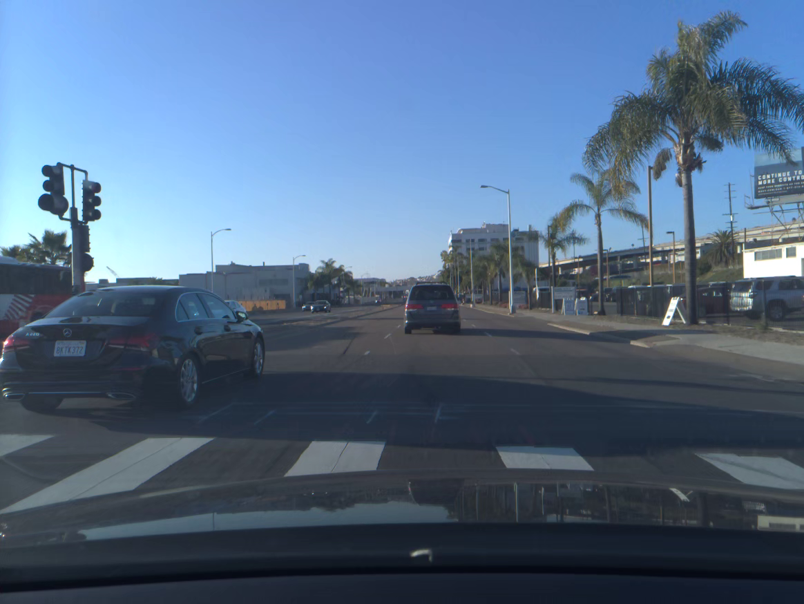
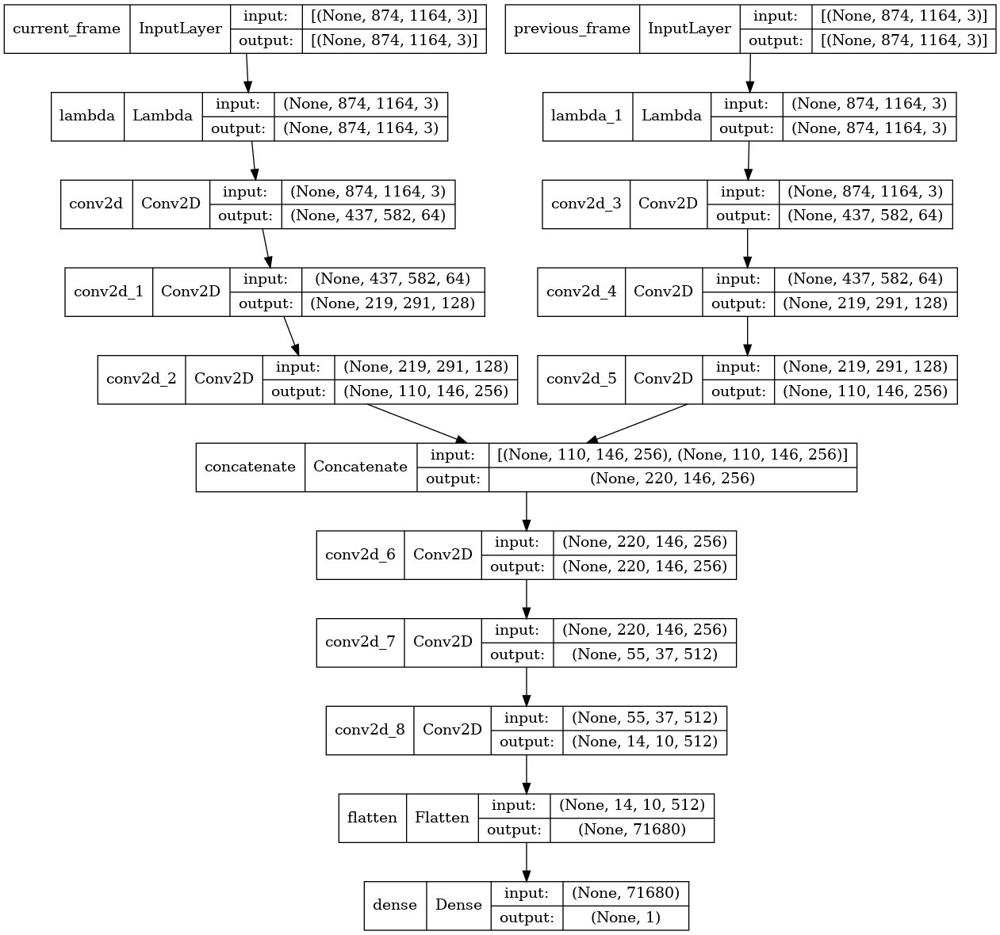

# comma.ai calibration challenge 
This repos is folked from https://github.com/commaai/calib_challenge  

  
source : comma.ai
------

# Context
------

While inferring from images/video feeding, deep neural network can give us information in image-coordinates which is needed to convert into real-world coordinates for autonomous driving stack.  
(this conversion can be however explicitly by geometric calculations or by deep neural net also)  
To refer image-coordinates to real-world coordinates, we need two kinds of information of the camera :  

	[x] intrinsic information  
		which is related to camera lens's focal length and sensor/lens installations  
		
	[x] extrinsic information
		which is related to camera installation in real-world coordinates (linear position [x y z], angular orientation [yaw pitch roll]).  
		*camera extrinsic information is subjected to perpetual changes because of camera-vehicle linking (camera position vs vehicle) and vehicle-ground linking (vehicle vs real-world).  

Our goal is to predict a part of extrinsic information [pitch and yaw angle in radians] from provided dashcam video which is in ideal condition can correct pre-calibrated extrinsic information.  

-----
# Approach
 
	## classical optical flow
	https://docs.opencv.org/3.4/d4/dee/tutorial_optical_flow.html
	[cv.calcOpticalFlowFarneback]  
	by comparing detected feature-points between two consecutive image frames, we can estimate the optical flow vector-field at each pixel in ideal  .
	from the optical-flow vector-field we can estimate yaw/pitch/roll angles and linear translations x/y/z in camera coordinates.  
	  
	as just simple ! but in reality, optical flow can be very noisy and calculation from optical-flow field is also complicated.  
	
	## deeplearning
	Taking the idea of optical flow calculation, we can inject two consecutive frames into a deep neural network that encode/decode/compare information at each pixel to then give a direct output of yaw and pitch angle of the camera at instant t.  
	Example :  
	  
	In fact, I used a model architecture inspired from resnet-18 to get converged training.  
	Epoch 30/30
	250/250 [==============================] - 195s 781ms/step - loss: 5.1514e-06 - val_loss: 7.0098e-04
	
	  
	

